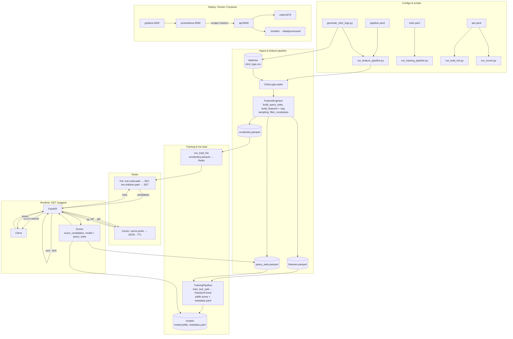
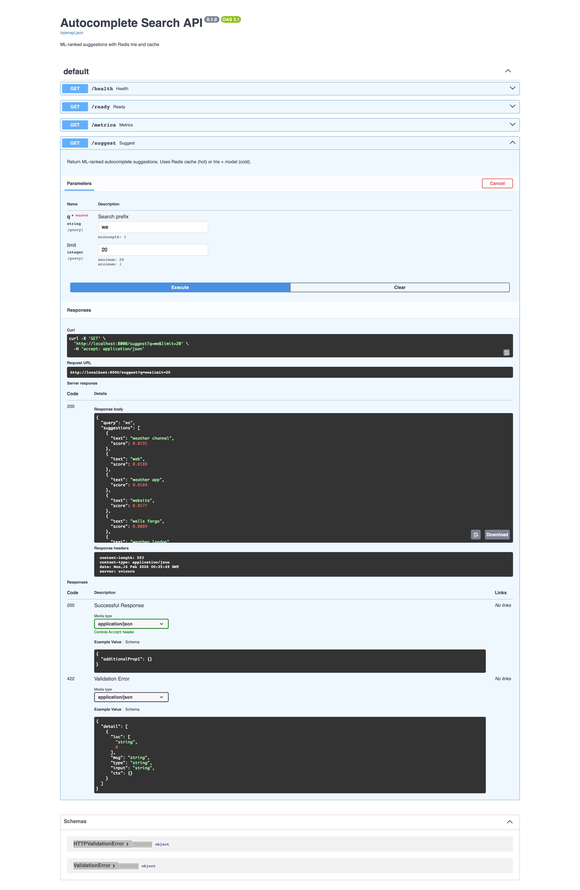
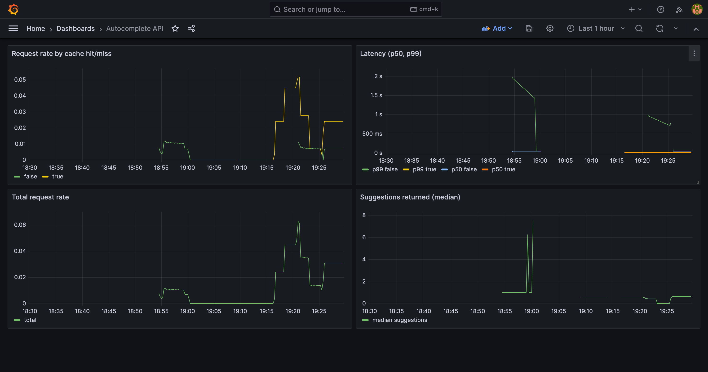

# Autocomplete Search

ML-powered autocomplete with a **click logs data pipeline**, **Redis trie**, **hot/cold cache**, and **FastAPI** service. Monitored with **Prometheus** and **Grafana**.

## Architecture



## Screenshots

**API / Swagger UI**



**Grafana dashboard**



## Project layout

```
configs/              # pipeline.yaml, train.yaml, api.yaml
data/
  raw/                # click_logs.csv (from generate_click_logs.py or your own)
  processed/          # features.parquet, vocabulary.parquet, query_stats.parquet
models/               # model.joblib, metadata.yaml
src/autocomplete/
  pipeline/           # ClickLogsLoader, FeatureEngineer, FeaturePipeline (loader, features, run)
  training/           # TrainingPipeline (train model from features)
  trie/               # RedisTrie
  cache.py            # SuggestionCache (hot/cold)
  scorer.py           # load model, score candidates
  api/app.py          # FastAPI + Prometheus metrics
scripts/
  generate_click_logs.py   # generate 3–4 MB raw click logs CSV
  run_feature_pipeline.py # click logs → features + vocabulary (uses pipeline.yaml)
  run_training_pipeline.py # features → trained model (uses train.yaml)
  run_load_trie.py         # load vocabulary into Redis (uses api.yaml)
tests/                # pytest: test_trie, test_cache
monitoring/           # Prometheus + Grafana configs and dashboards
Dockerfile            # API image
docker-compose.yaml   # api, redis, prometheus, grafana
```

## Requirements

- **Python 3.11+**
- **Redis** (local or Docker)
- Install: `pip install -e .` or `uv sync`

## Quick start

### 1. Install and run Redis

```bash
# Option A: Local (e.g. macOS)
brew install redis && brew services start redis

# Option B: Docker
docker run -d -p 6379:6379 --name redis redis:7-alpine

# Option C: Project stack (Redis only)
docker compose up -d redis
```

### 2. Install the project

From repo root:

```bash
pip install -e .
# or: uv sync
```

### 3. Generate click logs and run pipelines (optional)

If you don’t have `data/raw/click_logs.csv`:

```bash
python scripts/generate_click_logs.py   # writes ~3.5 MB data/raw/click_logs.csv
python scripts/run_feature_pipeline.py # → data/processed/*.parquet
python scripts/run_training_pipeline.py # → models/model.joblib
python scripts/run_load_trie.py         # load vocabulary into Redis (uses configs/api.yaml)
```

### 4. Run API locally

```bash
uvicorn autocomplete.api.app:app --reload --port 8000
```

- Docs: http://localhost:8000/docs  
- Example: http://localhost:8000/suggest?q=wea&limit=5  

### 5. Full stack with Docker (API + Redis + Prometheus + Grafana)

Ensure `models/` and `data/processed/` exist (e.g. after running the pipelines above), then:

```bash
docker compose up -d
```

- API: http://localhost:8000  
- Redis: localhost:6379  
- Prometheus: http://localhost:9090  
- Grafana: http://localhost:3000 (admin / admin)

## Data pipeline

1. **Click logs** CSV: columns `query`, `clicked_suggestion`, `position`, `timestamp` (ISO or unix).  
   Generate a sample: `python scripts/generate_click_logs.py`.

2. **Feature pipeline** (click logs → features + vocabulary):

   ```bash
   python scripts/run_feature_pipeline.py [--config configs/pipeline.yaml]
   ```

   Writes `data/processed/features.parquet`, `vocabulary.parquet`, `query_stats.parquet`.  
   Pipeline uses negative sampling so the training target has both clicked (1) and not-clicked (0).

3. **Training pipeline** (features → model):

   ```bash
   python scripts/run_training_pipeline.py [--config configs/train.yaml]
   ```

   Writes `models/model.joblib` and `models/metadata.yaml`.

4. **Load vocabulary into Redis trie**:

   ```bash
   python scripts/run_load_trie.py [--config configs/api.yaml]
   ```

   Reads Redis and vocabulary path from config (default `configs/api.yaml`).

## API

- **`GET /suggest?q=prefix&limit=10`** – Returns `{ "query", "suggestions": [{ "text", "score" }], "cached" }`.  
  Uses Redis cache (hot) or trie + ML ranking (cold), then caches result.
- **`GET /health`** – Liveness.
- **`GET /ready`** – Readiness (Redis + optional model).
- **`GET /metrics`** – Prometheus scrape.

## Config

- **`configs/pipeline.yaml`** – Input path, output paths, time decay, vocabulary size, negative sampling (`neg_per_pos`, `random_state`).
- **`configs/train.yaml`** – Train data path, model output, target column, feature columns, model params, validation split.
- **`configs/api.yaml`** – Redis (host, port, db, prefix, trie_key_prefix), vocabulary_path, model paths, suggest limits.

Scripts use these configs by default; override with `--config path/to/config.yaml`.  
Env overrides for the API: `REDIS_HOST`, `REDIS_PORT`, `MODEL_PATH`, `METADATA_PATH`, `QUERY_STATS_PATH`, `CACHE_TTL_SECONDS`.

## Tests

```bash
pytest
# or: pytest -v --cov=autocomplete
```

## Monitoring

When running with Docker Compose: **Prometheus** scrapes `api:8000/metrics` (request rate, latency, cache hit, suggestions returned). **Grafana** dashboard "Autocomplete API" is provisioned with the Prometheus datasource.

## Future work

Planned improvements and features.

### Logging

- [ ] Introduce structured logging across the codebase (e.g. `logging` or `structlog`).
- [ ] Use a single logger per module; avoid `print()` for operational messages.
- [ ] Add log levels (DEBUG, INFO, WARNING, ERROR) and make level configurable (env or config).
- [ ] Log pipeline stages (load, feature build, write), training (splits, score), API requests/errors, and trie load.
- [ ] Optionally ship logs to stdout in a format suitable for Docker/JSON (e.g. for aggregation).

### PySpark support

- [ ] Add optional PySpark-based pipeline path for large-scale click logs (e.g. when data does not fit in pandas).
- [ ] Implement or adapt loader to read CSV/Parquet via Spark (e.g. `spark.read.csv` / `spark.read.parquet`).
- [ ] Implement feature engineering (query_stats, build_features, filter_vocabulary) as Spark DataFrame transformations.
- [ ] Write outputs (features, vocabulary, query_stats) as Parquet with Spark; keep schema compatible with current pandas pipeline.
- [ ] Document when to use pandas vs Spark (e.g. config flag or separate script `run_feature_pipeline_spark.py`).
- [ ] Add `pyspark` as an optional dependency (e.g. `pip install autocomplete-search[spark]` or extra in pyproject.toml).

### ML neural model for ranking

- [ ] Design a neural ranking model (e.g. pointwise or pairwise) that consumes the same features (or embeddings) used today.
- [ ] Add optional embedding layer or query/suggestion encoders if moving beyond hand-crafted features.
- [ ] Implement training script (e.g. PyTorch or TensorFlow) with the same train/val split and config (train.yaml) where possible.
- [ ] Persist model artifact and metadata (feature list, normalization) so the API can load either RandomForest or the neural model.
- [ ] Update `scorer.py` (or add a neural scorer) to load and run the neural model for ranking suggestions.
- [ ] Add neural model as an optional dependency and document how to train and switch between RF and neural in config.

### Other ideas

- [ ] API: load Redis/trie/model from config file (e.g. api.yaml) in addition to or instead of env vars.
- [ ] Add integration tests (e.g. run pipeline → load trie → call `/suggest` and assert response shape/order).
- [ ] Support A/B testing or shadow mode (e.g. run two rankers and log both scores without changing response).
