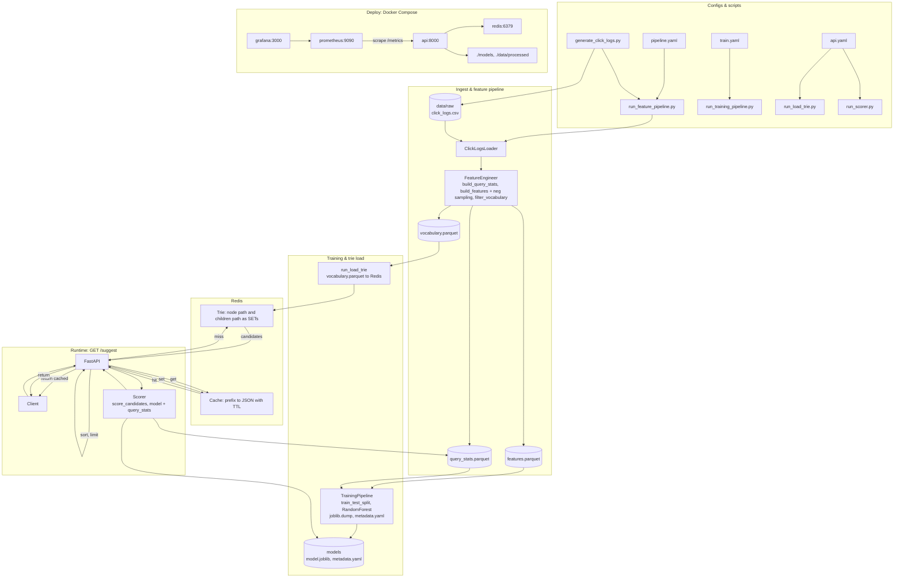

# Autocomplete Search

Autocomplete API that uses click logs to train a ranking model, stores suggestions in a **Redis trie**, and caches results. Built with **FastAPI**; metrics and dashboards with **Prometheus** and **Grafana**.

---

## What it does (features)

- **Ingest click logs** (query, clicked_suggestion, position, timestamp) and build features with negative sampling.
- **Train a RandomForest** on features; save model and metadata under `models/`.
- **Store completions in a Redis trie** (prefix lookup); load vocabulary via script.
- **Cache suggestion results** in Redis with TTL; hot path = cache, cold path = trie + model rank.
- **Expose GET /suggest** with ML-ranked suggestions; optional Prometheus metrics and Grafana dashboard.

---

## Architecture overview



---

## Screenshots

**API / Swagger UI**


**Grafana dashboard**


---

## Project layout and files

- **configs/** — `pipeline.yaml`, `train.yaml`, `api.yaml`
- **data/raw/** — `click_logs.csv` (from generator or your own)
- **data/processed/** — `features.parquet`, `vocabulary.parquet`, `query_stats.parquet`
- **models/** — `model.joblib`, `metadata.yaml`
- **src/autocomplete/** — `pipeline/` (loader, features, run), `training/`, `trie/`, `cache.py`, `scorer.py`, `api/app.py`
- **scripts/** — `generate_click_logs.py`, `run_feature_pipeline.py`, `run_training_pipeline.py`, `run_load_trie.py`, `run_scorer.py`
- **tests/** — `test_trie.py`, `test_cache.py`
- **monitoring/** — Prometheus and Grafana configs and dashboards
- **Dockerfile**, **docker-compose.yaml** — API image and full stack

---

## What you need (requirements)

- **Python 3.11+**
- **Redis** (local or Docker)
- Install: **`pip install -e .`** or **`uv sync`**

---

## Get up and running (quick start)

**1. Start Redis**

- Local: `brew install redis && brew services start redis`
- Docker: `docker run -d -p 6379:6379 --name redis redis:7-alpine`
- Or: `docker compose up -d redis`

**2. Install the project**

```bash
pip install -e .
```

**3. (Optional) Build data and model**

```bash
python scripts/generate_click_logs.py
python scripts/run_feature_pipeline.py
python scripts/run_training_pipeline.py
python scripts/run_load_trie.py
```

- First script writes ~3.5 MB CSV to **data/raw/**.
- Others write parquet to **data/processed/**, model to **models/**, and load vocabulary into Redis (config: **configs/api.yaml**).

**4. Run the API locally**

```bash
uvicorn autocomplete.api.app:app --reload --port 8000
```

- **Docs:** http://localhost:8000/docs
- **Example:** http://localhost:8000/suggest?q=wea&limit=5

**5. Or run the full stack in Docker**

After you have **models/** and **data/processed/**:

```bash
docker compose up -d
```

- **API** 8000 · **Redis** 6379 · **Prometheus** 9090 · **Grafana** 3000 (admin / admin)

---

## Data pipeline: from logs to model

- **Click logs:** CSV with **query**, **clicked_suggestion**, **position**, **timestamp** (ISO or unix). Generate sample: `python scripts/generate_click_logs.py`.
- **Feature pipeline:** `python scripts/run_feature_pipeline.py` — builds features and vocabulary; uses **negative sampling**; writes **features.parquet**, **vocabulary.parquet**, **query_stats.parquet** to **data/processed/**.
- **Training:** `python scripts/run_training_pipeline.py` — trains **RandomForest**, saves **model.joblib** and **metadata.yaml** to **models/**.
- **Load trie:** `python scripts/run_load_trie.py` — reads vocabulary from config and fills the **Redis trie**.

---

## API endpoints

- **GET /suggest?q=prefix&limit=10** — Returns suggestions (text + score) and a **cached** flag. Uses cache when present; otherwise trie + model rank, then caches.
- **GET /health** — Liveness.
- **GET /ready** — Readiness (Redis and optional model).
- **GET /metrics** — Prometheus scrape.

---

## Configuration files

- **configs/pipeline.yaml** — Input/output paths, time decay, vocabulary size, **neg_per_pos**, **random_state**.
- **configs/train.yaml** — Train data path, model output, target column, feature columns, model params, validation split.
- **configs/api.yaml** — Redis (host, port, db, prefixes), **vocabulary_path**, model paths, suggest limits.

Override with **`--config path/to/config.yaml`**. API env overrides: **REDIS_HOST**, **REDIS_PORT**, **MODEL_PATH**, **METADATA_PATH**, **QUERY_STATS_PATH**, **CACHE_TTL_SECONDS**.

---

## Running tests

- **`pytest`** from repo root.
- With coverage: **`pytest -v --cov=autocomplete`**.

---

## Monitoring (Prometheus and Grafana)

- **Prometheus** scrapes **api:8000/metrics** (request rate, latency, cache hit, suggestion counts).
- **Grafana** has a preconfigured Prometheus datasource and an **Autocomplete API** dashboard.

---

## Future work

- **Logging** — Structured logging, configurable levels, pipeline/training/API log points.
- **PySpark** — Optional Spark path for large click logs; same schema as pandas pipeline.
- **Neural ranker** — Pointwise/pairwise model; train script and scorer integration.
- **Other** — Config-driven API, integration tests, A/B or shadow ranking.
